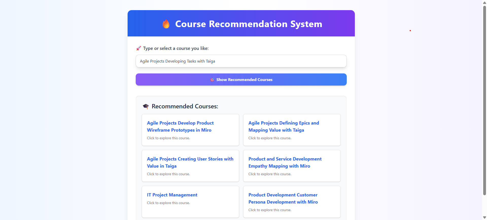

# Course Recommendation System

A content-based recommendation system built using **Python**, **Flask**, and **NLP techniques** that suggests similar online courses based on a user-selected course title.

---

## Features

-  Search or select any course
-  Instantly receive 5–6 similar course recommendations
-  Each result links directly to the course URL
-  Built with Flask (backend) and TailwindCSS (frontend)
-  Fast and lightweight (no online API calls needed)

---

## How It Works

1. **Dataset Preprocessing**:

   - Only `course_name` and `course_url` are used from the original dataset
   - Cleaned and vectorized using **CountVectorizer** (Bag of Words model)

2. **Similarity Computation**:

   - Pairwise **cosine similarity** is computed between all course titles
   - Top similar courses are selected based on similarity scores

3. **Web Interface**:
   - User selects or types a course name
   - Backend returns top similar courses with links
   - Frontend displays them in a modern card-style layout

---

## Tech Stack

### Backend

- **Python 3**
- **Flask** (routing & rendering)
- **Pickle** (for storing models)
- **Pandas & NumPy**
- **scikit-learn** (for CountVectorizer and Cosine Similarity)

### Frontend

- **HTML5**
- **Tailwind CSS** (UI Styling)
- **Jinja2 Templates** (via Flask)

### Files

| File                                 | Purpose                                           |
| ------------------------------------ | ------------------------------------------------- |
| `app.py`                             | Flask server to handle routing and logic          |
| `templates/index.html`               | Frontend HTML using Tailwind                      |
| `models/courses.pkl`                 | Pickled course DataFrame                          |
| `models/similarity.pkl`              | Precomputed cosine similarity matrix              |
| `models/course_list.pkl`             | List of all course names                          |
| `Course Recommendation System.ipynb` | Notebook for data processing and model generation |
| `Coursera.csv`                       | Original course dataset                           |

---
